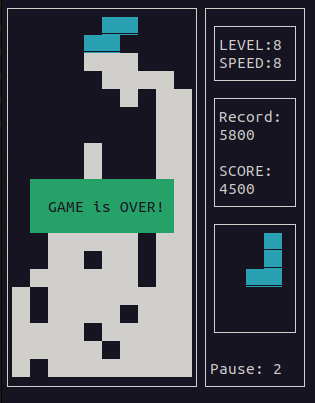

## About the project

A demonstration of my implementation of the school project 21 - Brick Game v1.0, or simply Tetris. The project is made in a functional style in the C language. The purpose of this project is to work out the skill and deepen knowledge in the following topics:

- Finite state machines;
- Working with matrices;
- Working with files;
- Splitting the game into parts (backend and frontend).

Below are the tasks and requirements for the project, as well as images with the KA scheme and the game.

The project is assembled in the terminal using a Makefile and all commands work from the root folder of the project.
Goals in the Makefile:

- `all` - starts the game.
- `make install` - installs the game and creates a tetris binary file.
- `make uninstall` - deletes all created object files and the game file.
- `make test` - builds the project if it is not assembled and tests all functions for their correctness.
- `make gov_report` - starts testing functions and creates an html report on the coverage of functions during testing, upon completion opens the report in the browser.
- `make clean` - deletes all created object files and the game file and test files if they were running.
- `make dist` - installs the game and archives it in tar.gz along with KA and README.
- `make dvi` - converts .md file to .dvi file format.
- `make pdf` - converts .dvi file to .pdf file format.

## Project Requirements

### Part 1. Main task

You need to implement the BrickGame v1.0 aka Tetris program:

- The program must be developed in C language of C11 standard using gcc compiler.
- The program must consist of two parts: a library implementing the logic of the tetris game, and a terminal interface using the `ncurses` library.
- A finite-state machine must be used to formalize the logic of the game.
- The library must have a function that accepts user input and a function that outputs a matrix that describes the current state of the playing field whenever it is changed.
- The program library code must be located in the `src/brick_game/tetris` folder.
- The program interface code must be located in the `src/gui/cli` folder
- The program must be built using a Makefile with the standard set of targets for GNU-programs: all, install, uninstall, clean, dvi, dist, test, gcov_report. Installation directory can be arbitrary
- The program must be developed in accordance with the principles of structured programming.
- Stick to Google Style when writing code.
- Prepare full coverage of the library with unit tests, using the `check` library (tests must run on Darwin/Ubuntu OS). The coverage of the library with game logic with tests must be at least 80 percent.
- The following mechanics must be in the game:
  - Rotation of pieces;
  - Moving pieces horizontally;
  - Acceleration of the piece's fall (when the button is pressed, the figure moves all the way down);
  - Display of the next piece;
  - Destruction of filled raws;
  - End of the game when the top border of the playing field is reached;
  - All sorts of pieces shown in the picture below must be included in the game.
- Add support for all the buttons provided on the physical console for control:
  - Start game,
  - Pause,
  - End game,
  - Left arrow - movement of the piece to the left,
  - Right arrow - movement of the piece to the right,
  - Down arrow - piece falls,
  - Up arrow is not used in this game,
  - Action (piece rotation).
- The playing field must match the dimensions of the console's playing field - ten "pixels" wide and twenty "pixels" high.
- After reaching the lower boundary of the field or contacting another figure, the figure must stop. After that, the next piece, shown in the preview, is generated.
- The library interface must correspond to the description found in materials/library-specification.md.
- The UI must support rendering of the playing field and additional information.
- Prepare a diagram in any format describing the used FSM (its states and all possible transitions).

Pieces used:

### Part 2. Bonus. Scoring and game record

Add the following mechanics to the game:

- scoring;
- storing maximum points.

This information must be passed and displayed by the user interface in the sidebar. The maximum number of points must be stored in a file or embedded DBMS and saved between program runs.

The maximum number of points must be changed during the game if the user exceeds the current maximum score.

Points will be accrued as follows:

- 1 row is 100 points;
- 2 rows is 300 points;
- 3 rows is 700 points;
- 4 rows is 1500 points;

### Part 3. Bonus. Level mechanics

Add level mechanics to the game. Each time a player gains 600 points, the level increases by 1. Increasing the level boosts the speed at which the pieces move. The maximum number of levels is 10.
